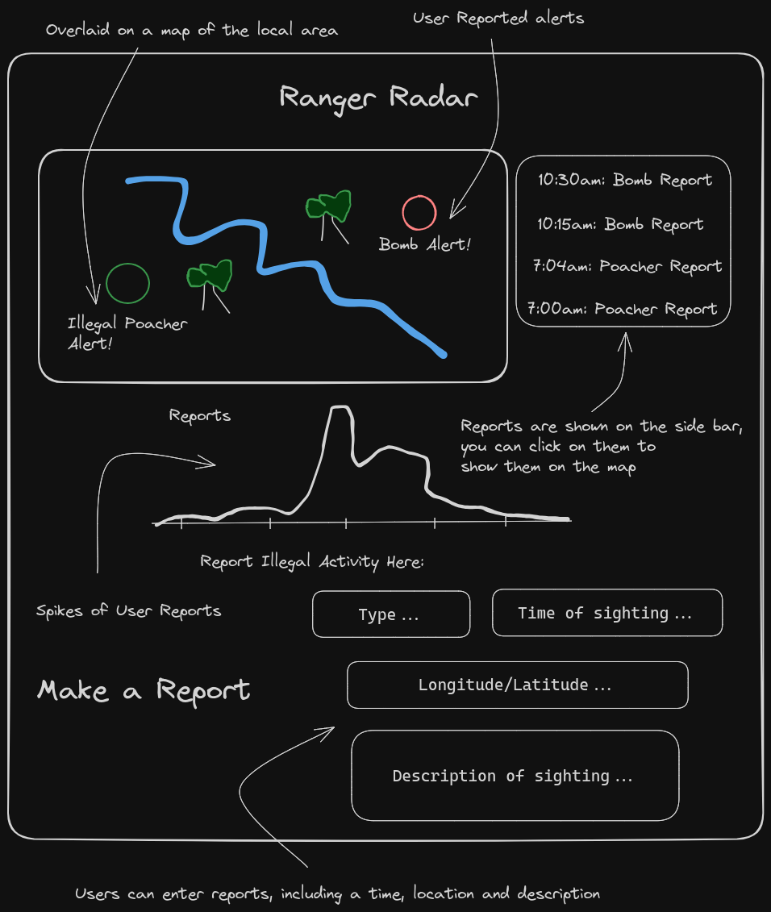
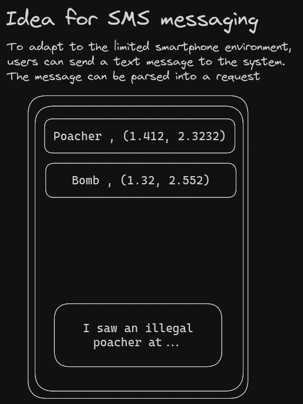

# RangerRadar




## Setup

> [!IMPORTANT]
>
> ### Prerequisites
>
> - Docker
>
> Docker will handle the dependencies such as PostgreSQL, NodeJS and NPM.
> On Windows/MacOS, I'd recommend installing the Docker GUI, as it also installs all the CLI tools, check the Docker section for more.
>
> If you're unsure about Docker at all, I highly recommend these 2 videos below, they offer most of what you need, very quickly.
>
> [docker in 100 seconds](https://www.youtube.com/watch?v=Gjnup-PuquQ) and [setting up docker](https://www.youtube.com/watch?v=gAkwW2tuIqE)

### Build and Run

In the root directory, run:

```sh
$ docker compose up --build
```

Note that `docker-compose` is outdated, though still shows up on a lot of tutorials/guides. Use `docker compose` instead.

Which should result in output similar to this trimmed down reading:

```sh
[+] Running 15/15
 ✔ rr-db Pulled
   ✔ 09f376ebb190 Pull complete
   ✔ 119215dfb3e3 Pull complete

    ~ more things

[+] Building 29.3s (10/10) FINISHED
 => [rr-frontend internal] load build definition from Dockerfile
 => => transferring dockerfile: 249B
 => [rr-frontend internal] load metadata for docker.io/library/node:20
 => [rr-frontend internal] load .dockerignore
 => => transferring context: 112B
 => [rr-frontend 1/5] FROM docker.io/library/node:20@sha256:ab71b9da5ba19445dc5bb76bf99c218941db2c4d70ff4de4e0d9ec90920bfe3f
 => => resolve docker.io/library/node:20@sha256:ab71b9da5ba19445dc5bb76bf99c218941db2c4d70ff4de4e0d9ec90920bfe3f

    ~ more downloads

 => [rr-frontend internal] load build context
 => => transferring context: 57.45kB
 => [rr-frontend 2/5] WORKDIR /node
 => [rr-frontend 3/5] COPY package*.json ./
 => [rr-frontend 4/5] RUN npm install
 => [rr-frontend 5/5] COPY . .
 => [rr-frontend] exporting to image
 => => exporting layers
 => => writing image sha256:ea9c8a21058a5ade67ad0754f7c491e6607a063add60610b6948cf8fa93c9109
 => => naming to docker.io/library/rangerradar-rr-frontend
[+] Running 3/3
 ✔ Network rangerradar_default  Created
 ✔ Container rr-postgres        Created
 ✔ Container rr-node            Created
Attaching to rr-node, rr-postgres

    ~ things related to the postgres startup

rr-postgres  | 2024-05-30 23:53:57.087 UTC [1] LOG:  database system is ready to accept connections
rr-node      |
rr-node      | > node@0.0.0 start
rr-node      | > node ./bin/www
rr-node      |
```

The first build will take a while, caching will speed up future builds.
The Node and Postgres containers will be running, you can see them using:

```sh
$ docker ps
```

Which should show the 2 containers:

```sh
CONTAINER ID   IMAGE                     COMMAND                  CREATED         STATUS                   PORTS                                                 NAMES
e1a3793f85ba   rangerradar-rr-frontend   "docker-entrypoint.s…"   6 minutes ago   Up 2 seconds             3000/tcp, 0.0.0.0:8080->8080/tcp, :::8080->8080/tcp   rr-node
22a0e6864799   postgres                  "docker-entrypoint.s…"   6 minutes ago   Up 4 seconds (healthy)   0.0.0.0:5432->5432/tcp, :::5432->5432/tcp             rr-postgres
```

When you want to restart the containers, just use `ctrl-c` on the command. If you want to delete them and completely rebuild, run `docker compose down` before running `docker compose up --build`. Note that this completely wipes any existing data in the database, which gets repopulated by the startup script.

Alternatively, you can do all this in the Docker GUI or even in your editor using the right extensions.

It is also worth noting that in the current configuration, the node server is dependant on the health check of the postgres server. In the event of a postgres failure, you can run the node server by itself with:

```sh
$ docker build -t rr-node ./node
[+] Building 0.5s (10/10) FINISHED                                                                                                                                                                    docker:default
 => [internal] load build definition from Dockerfile                                                                                                                                                            0.0s
 => => transferring dockerfile: 249B                                                                                                                                                                            0.0s
 => [internal] load metadata for docker.io/library/node:20                                                                                                                                                      0.4s
 => [internal] load .dockerignore                                                                                                                                                                               0.0s
 => => transferring context: 112B                                                                                                                                                                               0.0s
 => [1/5] FROM docker.io/library/node:20@sha256:ab71b9da5ba19445dc5bb76bf99c218941db2c4d70ff4de4e0d9ec90920bfe3f                                                                                                0.0s
 => [internal] load build context                                                                                                                                                                               0.0s
 => => transferring context: 2.03kB                                                                                                                                                                             0.0s
 => CACHED [2/5] WORKDIR /node                                                                                                                                                                                  0.0s
 => CACHED [3/5] COPY package*.json ./                                                                                                                                                                          0.0s
 => CACHED [4/5] RUN npm install                                                                                                                                                                                0.0s
 => CACHED [5/5] COPY . .                                                                                                                                                                                       0.0s
 => exporting to image                                                                                                                                                                                          0.0s
 => => exporting layers                                                                                                                                                                                         0.0s
 => => writing image sha256:37be2088fde2d4505d9b6e7d7c593d872519187ebf8d9d675aa22f80f274ff79                                                                                                                    0.0s
 => => naming to docker.io/library/rr-node                                                                                                                                                                      0.0s
$ docker run -e PORT=8080 -d -p 8080:8080 rr-node
00564205b7583902e9ea249eba4851b2923c0cae312b594b29a9f8f88d44cc20
```

## Database documentation

### Schema

## Testing

We are using [jest.js](https://jestjs.io/) for unit testing and [cypress](https://www.cypress.io/) for end to end testing.

Since these tests are away from docker containers, remember to use `npm install` to have everything up to date.

To run unit tests, simply `cd` into `node/` and run `npm test`, which should look something like this:

```sh
$ npm test
> node@0.0.0 test
> jest --verbose

 PASS  jest/report.test.js
  Report
    ✓ is built from string correctly (2 ms)

Test Suites: 1 passed, 1 total
Tests:       1 passed, 1 total
Snapshots:   0 total
Time:        0.243 s
Ran all test suites.
```

To run the e2e tests, again `cd` into `node/` and run `npm run e2e`. Then, a cypress window should open asking you which type of tests you want to run and on what platform. The platforms available are dependent on what you have installed on your system.

```sh
$ npm run e2e

> node@0.0.0 e2e
> cypress open

DevTools listening on ws://127.0.0.1:40929/devtools/browser/3f912fbb-1b63-4ff5-b135-1d94b7c2c915
```

## Development notes

#### Things to keep in mind

### Project Styling

Following the [google style guide for js](https://google.github.io/styleguide/jsguide.html).
